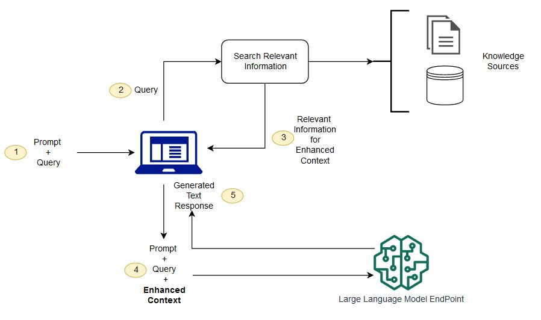

# Retrieval Augmented Generation

Large language models (LLMs) are trained on vast amounts of data and use billions of parameters to generate original output for tasks such as answering questions, translating languages, and completing sentences. However, they **cannot access real-time information** or **domain-specific knowledge** that falls outside their training data. Additionally, LLMs are prone to generating inaccurate or fabricated content, commonly referred to as [[Hallucination]].

**Retrieval-Augmented Generation**, also known as **RAG**, addresses these limitations. RAG enhances LLM output by retrieving relevant information from an external, authoritative knowledge base **before** generating a response. This approach improves **factual accuracy**, **reduces hallucinations**, and enables **domain-specific applications**—without the need for costly model retraining.

## How does it work?

Without RAG, a large language model (LLM) generates responses based solely on the data it was trained on, which may be outdated or lack domain-specific context. With RAG, however, an **information retrieval component** is introduced. This component uses the user's prompt to fetch relevant content from external sources—such as vector databases or the internet. The LLM then combines this retrieved information with its existing knowledge to generate a response that is **more accurate, up-to-date, and contextually relevant** than what it could produce using training data alone.

## References

- https://blogs.nvidia.com/blog/what-is-retrieval-augmented-generation/
- https://aws.amazon.com/what-is/retrieval-augmented-generation/
- https://chatgpt.com